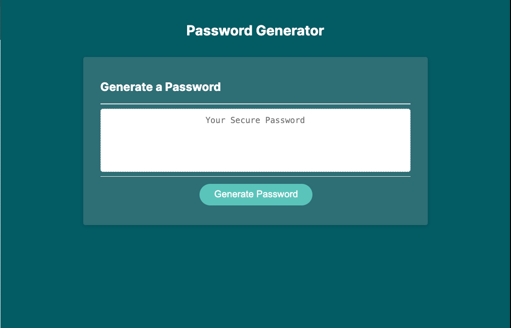

# Password Generator

This is a solution to a password generator assignment assignment from SkillHat. _[SkillHat](https://skillhat.ca/)_ is the bridge between tech talent and industry needs.

## Table of contents

- [Overview](#overview)
  - [The challenge](#the-challenge)
  - [Screenshot](#screenshot)
  - [Links](#links)
- [My process](#my-process)
  - [Built with](#built-with)
  - [What I learned](#what-i-learned)
  - [Continued development](#continued-development)
  - [Useful resources](#useful-resources)
- [Author](#author)
- [Acknowledgments](#acknowledgments)

## Overview

### The challenge

1. Generate a password when the button is clicked

   - Present a series of prompts for password criteria
   - Length of password: At least 8 characters but no more than 128.
   - Character types

     - Lowercase
     - Uppercase
     - Numeric
     - Special characters ($@%&\*, etc)

   - Code should validate for each input and at least one character type should be selected
   - Once prompts are answered then the password should be generated and displayed in
     an alert or written to the page

### Screenshot

### Links

- Solution URL: https://github.com/Abimbola-ai/password-generator
- Live Site URL: https://abimbola-ai.github.io/

## My process

### Built with

- Semantic HTML5 markup
- CSS custom properties
- Javascript

### What I learned

- Random in Javascript
- Array in Javascript
- Comment effectively and write clean code.
- Use of flex and positioning in css

## Author

- LinkedIn - [ojikutu-olajumoke](https://www.https://www.linkedin.com/in/ojikutu-olajumoke/)

## Acknowledgments

A big thanks to SkillHat for providing a platform to challenge and enhance my abilities. Thanks also to my frontend instructor [Edward Apostol](https://www.linkedin.com/in/edwardapostol/ 'Instructor')
